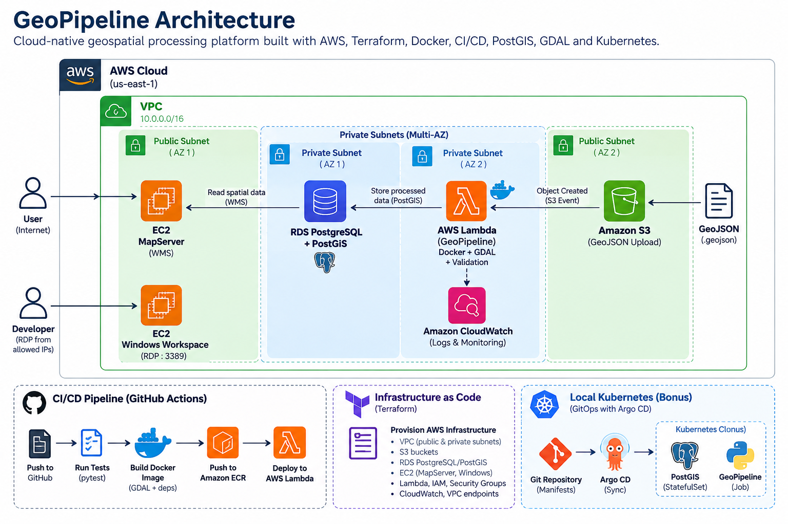
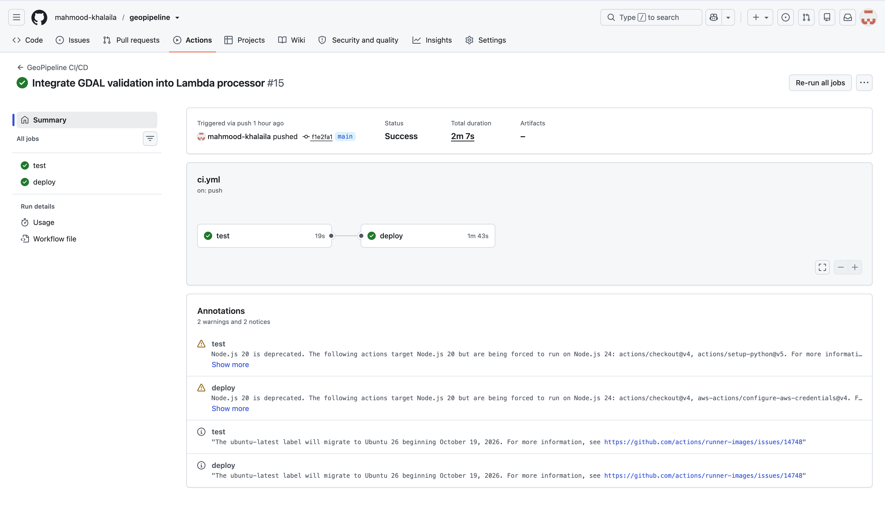
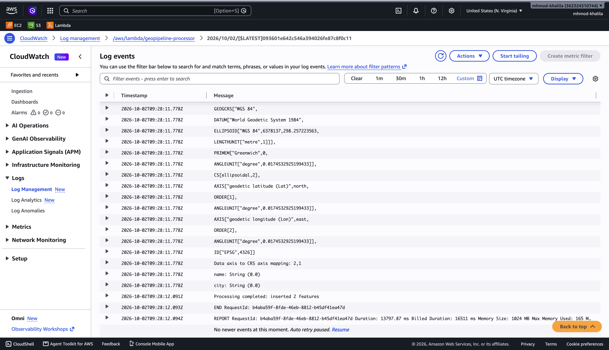
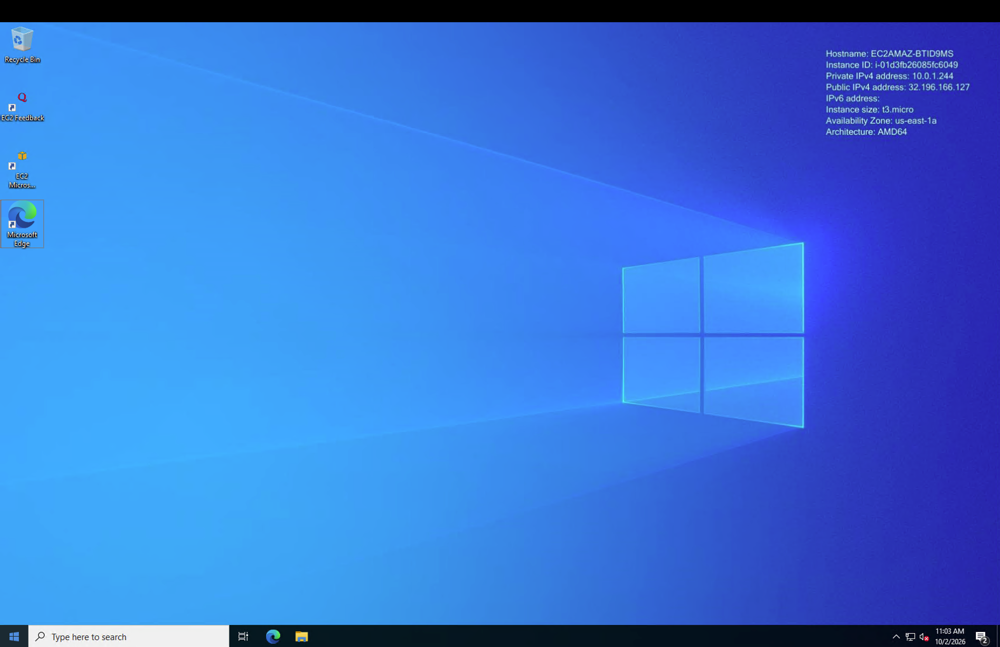
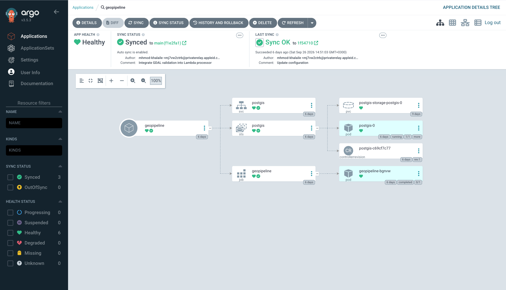

# GeoPipeline

GeoPipeline is a cloud-native geospatial data processing platform built as a DevOps project.

The platform automatically processes GeoJSON files uploaded to Amazon S3, validates and inspects them using Python, GDAL, and GeoPandas, stores the spatial data in PostgreSQL/PostGIS, and exposes the processed data through a public MapServer WMS endpoint.

The project demonstrates Infrastructure as Code, event-driven processing, containerization, CI/CD, secure AWS networking, observability, and Kubernetes GitOps.

---

## Architecture



### End-to-End Flow

```text
GeoJSON
   │
   ▼
Private Amazon S3
   │
   │ ObjectCreated Event
   ▼
AWS Lambda Container
   │
   ├── GDAL inspection
   ├── GeoPandas
   ├── GeoJSON validation
   │
   ▼
Private PostgreSQL / PostGIS RDS
   │
   ▼
MapServer EC2
   │
   ▼
WMS
   │
   ▼
Browser

Lambda Logs ─────────► Amazon CloudWatch
```

---

## AWS Infrastructure

The AWS environment is provisioned using Terraform.

The infrastructure includes:

- VPC
- Two public subnets
- Two private subnets
- Internet Gateway
- Public and private route tables
- Security Groups
- Private S3 ingest bucket
- S3 Gateway VPC Endpoint
- AWS Secrets Manager Interface VPC Endpoint
- PostgreSQL RDS with PostGIS
- Amazon ECR repositories
- AWS Lambda
- IAM roles and policies
- GitHub OIDC integration
- MapServer EC2 instance
- Windows development workspace
- Public S3 documentation bucket
- Private S3 IaC backup bucket

The subnets are distributed across two Availability Zones.

Availability Zones are selected dynamically through Terraform to improve regional portability.

---

## Network Architecture

The system follows a public/private network design.

### Public Subnets

The public subnets contain:

- MapServer EC2
- Windows development workspace

The public route table provides Internet access through an Internet Gateway.

### Private Subnets

The private subnets contain:

- AWS Lambda processing environment
- PostgreSQL/PostGIS RDS

The RDS database is not publicly accessible.

Lambda communicates with AWS services without requiring a NAT Gateway:

```text
Lambda
  │
  ├──► S3 Gateway Endpoint ──► Amazon S3
  │
  ├──► Secrets Manager Interface Endpoint
  │
  └──► PostgreSQL/PostGIS RDS
```

Security Groups control communication between the individual components.

---

## Data Processing Pipeline

### 1. GeoJSON Upload

A GeoJSON file is uploaded to a private Amazon S3 ingest bucket.

### 2. S3 Event

The S3 bucket is configured to invoke the processing Lambda function whenever a `.geojson` object is created.

```text
GeoJSON Upload
      │
      ▼
     S3
      │
      │ ObjectCreated
      ▼
   Lambda
```

### 3. Containerized Processing

The Lambda function runs from a Docker image stored in Amazon ECR.

The processing application uses:

- Python
- GDAL / `ogrinfo`
- GeoPandas
- psycopg

GDAL inspects the uploaded geospatial file before the application performs its own validation.

### 4. GeoJSON Validation

The application validates the GeoJSON FeatureCollection before inserting data into the database.

Invalid data is rejected instead of being inserted into PostGIS.

### 5. PostGIS Storage

Validated features are inserted into PostgreSQL RDS with the PostGIS extension enabled.

The `locations` table stores:

- Feature name
- JSON properties
- Spatial geometry
- Creation timestamp

Geometry is stored using SRID 4326.

---

## MapServer / WMS

A containerized MapServer instance runs on Amazon EC2.

MapServer connects to the private PostGIS database and exposes the stored spatial information using WMS.

```text
PostGIS
   │
   ▼
MapServer
   │
   ▼
WMS
   │
   ▼
Browser
```

Only MapServer is publicly exposed. The underlying PostgreSQL/PostGIS database remains private.

### WMS Result


---

## CI/CD

GitHub Actions provides the CI/CD pipeline.

The workflow is triggered by changes to the `main` branch.

The pipeline performs:

```text
Git Push
   │
   ▼
GitHub Actions
   │
   ├──► Install dependencies
   ├──► Run pytest
   ├──► Authenticate to AWS with OIDC
   ├──► Build Docker image
   ├──► Tag image with Git commit SHA
   ├──► Push image to Amazon ECR
   │
   ▼
Update AWS Lambda
```

The Git commit SHA provides an immutable version identifier for each deployed processor image.

GitHub Actions authenticates to AWS using OpenID Connect (OIDC), avoiding long-lived AWS access keys in GitHub.

### Successful CI/CD Run



---

## Monitoring and Logging

AWS CloudWatch captures the Lambda execution logs.

The logs provide visibility into:

- S3 event processing
- File download
- GDAL inspection
- Coordinate Reference System detection
- GeoJSON validation
- Database insertion
- Lambda execution result

A successful processing execution confirms that the uploaded GeoJSON passed through the complete processing pipeline.

### CloudWatch Processing Logs



---

## Security

The project uses a private-by-default architecture.

### Database

- RDS is deployed in private subnets.
- Public database access is disabled.
- PostgreSQL port `5432` is restricted through Security Groups.

### Credentials

RDS credentials are managed by AWS Secrets Manager.

Credentials are not stored directly in the source code or Terraform configuration.

### GitHub Authentication

GitHub Actions uses AWS OIDC federation.

```text
GitHub Actions
      │
      │ OIDC Token
      ▼
    AWS STS
      │
      ▼
Temporary AWS Credentials
```

This removes the need for long-lived AWS access keys in GitHub.

### S3

The ingest bucket is private.

Lambda accesses S3 through an S3 Gateway VPC Endpoint.

### Secrets Manager

Lambda accesses Secrets Manager through an Interface VPC Endpoint.

### RDP

The Windows development workspace allows RDP only from a configurable CIDR range instead of exposing port `3389` to the entire Internet.

### MapServer

The public MapServer Security Group exposes only the required HTTP service.

---

## Development Workspace

A Windows Server EC2 instance provides a remote development workspace.

The instance is deployed in a public subnet and can be accessed using Remote Desktop Protocol (RDP).

Access to TCP port `3389` is restricted using the Terraform variable:

```text
rdp_allowed_cidr
```

This allows the permitted source IP range to be changed without modifying the infrastructure code.

### Windows RDP Workspace



---

## Infrastructure as Code

Terraform is used to create and manage the AWS infrastructure.

The Terraform configuration includes:

```text
terraform/
├── dev-workspace.tf
├── main.tf
├── outputs.tf
├── providers.tf
└── variables.tf
```

Terraform configuration files are also backed up to a private Amazon S3 bucket.

Sensitive local configuration such as Terraform state, local variable values, and private keys is not included in the repository.

### Regional Portability

Availability Zones are dynamically selected rather than hard-coded.

This improves the ability to deploy the infrastructure in another AWS region.

A full duplicate deployment followed by teardown in a second AWS region was not executed as part of this implementation.

---

## Kubernetes

A local Kubernetes deployment is included as an additional implementation.

The Kubernetes environment contains:

- GeoPipeline Job
- PostgreSQL/PostGIS StatefulSet
- PersistentVolumeClaim
- Kubernetes Service
- Kubernetes Secret

The processing application runs as a Kubernetes Job because GeoPipeline performs a finite processing task rather than operating as a continuously running web service.

PostGIS runs as a StatefulSet because it requires persistent state and storage.

---

## Helm

The Kubernetes resources are packaged using Helm.

The Helm chart allows configuration such as:

- Container image
- Image tag
- Database configuration
- PostGIS image
- Storage size
- Existing Kubernetes Secret
- Job retry configuration

This avoids duplicating Kubernetes manifests for different configurations.

---

## GitOps with Argo CD

Argo CD manages the local Kubernetes deployment using the GitOps model.

```text
Git Repository
      │
      ▼
   Argo CD
      │
      ▼
  Helm Chart
      │
      ├──► GeoPipeline Job
      │
      └──► PostGIS StatefulSet
```

Git represents the desired state of the Kubernetes environment.

Argo CD compares the desired state stored in Git with the actual state running in Kubernetes and synchronizes the cluster when required.

Automatic synchronization is enabled for the GeoPipeline application.

### Argo CD Application



---

## Local Development

Create and activate a Python virtual environment:

```bash
python3 -m venv .venv
source .venv/bin/activate
```

Install the dependencies:

```bash
pip install -r requirements.txt
```

Run the automated tests:

```bash
pytest
```

Process a local sample:

```bash
python -m src.process_file samples/hospitals.geojson
```

---

## Docker

Build the GeoPipeline processor image:

```bash
docker build -t geopipeline .
```

A Docker Compose environment is available for running the processor with PostGIS locally:

```bash
docker compose up --build
```

---

## Testing

Automated tests are implemented using pytest.

The tests cover cases including:

- Valid GeoJSON FeatureCollection
- Missing geometry
- Missing feature name

Tests run automatically as part of the GitHub Actions CI/CD pipeline before a new processor image is deployed.

---

## Project Structure

```text
geopipeline/
├── .github/
│   └── workflows/
│       └── ci.yml
│
├── argocd/
│   └── application.yaml
│
├── docs/
│   ├── half-pager.html
│   └── screenshots/
│       ├── architecture.png
│       ├── argocd-gitops.png
│       ├── cloudwatch-processing.png
│       ├── github-actions-success.png
│       ├── mapserver-wms.png
│       └── windows-rdp.png
│
├── geopipeline-chart/
│   ├── templates/
│   └── values.yaml
│
├── k8s/
│
├── samples/
│   └── hospitals.geojson
│
├── src/
│   ├── database.py
│   ├── gdal_processor.py
│   ├── lambda_handler.py
│   ├── process_file.py
│   └── validator.py
│
├── terraform/
│   ├── dev-workspace.tf
│   ├── main.tf
│   ├── outputs.tf
│   ├── providers.tf
│   └── variables.tf
│
├── tests/
├── Dockerfile
├── docker-compose.yml
├── requirements.txt
└── README.md
```

---

## Technology Stack

| Area | Technologies |
|---|---|
| Cloud | AWS |
| Infrastructure as Code | Terraform |
| Containers | Docker, Amazon ECR |
| CI/CD | GitHub Actions |
| Processing | Python, GDAL, GeoPandas |
| Database | PostgreSQL, PostGIS |
| GIS | MapServer, WMS |
| Event Processing | Amazon S3, AWS Lambda |
| Monitoring | Amazon CloudWatch |
| Security | IAM, OIDC, Secrets Manager, Security Groups |
| Kubernetes | Kubernetes, Helm |
| GitOps | Argo CD |

---

## Project Result

GeoPipeline implements an automated geospatial processing workflow:

```text
GeoJSON
   ↓
Amazon S3
   ↓
AWS Lambda
   ↓
GDAL + GeoPandas + Validation
   ↓
PostgreSQL / PostGIS
   ↓
MapServer
   ↓
WMS
```

Infrastructure is provisioned with Terraform, application delivery is automated through GitHub Actions and Amazon ECR, runtime logs are available through CloudWatch, and an additional Kubernetes environment is managed declaratively using Helm and Argo CD.